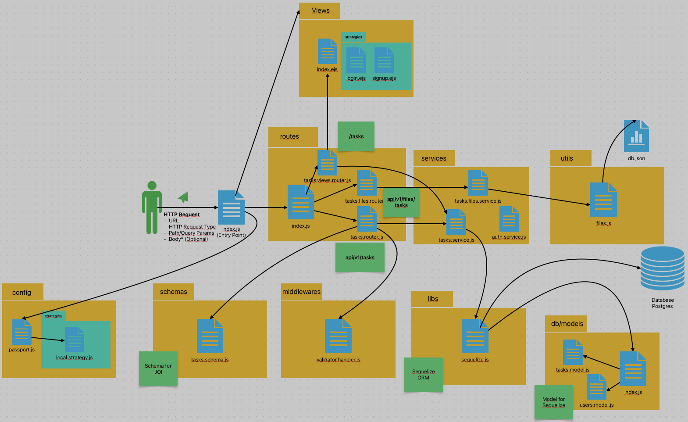

# API Listado de tareas - Programación Web 2 📚

Proyecto creado en la materia Programación web 2 del programa de Ingeniería Informática de la Univerdad de Caldas.

El proyecto consiste en la elaboración de una API usando *Node* versión > 18 con *ESModules*.

## Funcionalidad construida

La API consiste en un gestor de tareas, la idea es poder realizar todas las operaciones básicas (insertar, consultar, actualizar y eliminar) sobre una tabla de tareas de una base de datos. 

La API tiene dos enrutadores, el primero de ellos mapea todas las rutas que funcionan con un archivo en formato JSON como base de datos, en este caso el objetivo fue mostrar el uso de los módulos built-in, por ejemplo [FileSystem](https://nodejs.org/docs/latest/api/fs.html).

En el segundo enrutador se mapean las rutas para realizar las operaciones CRUD en la base de datos, para esta labor se usa el ORM [Sequelize](https://www.npmjs.com/package/sequelize) que es el encargado de la conexión con la base de datos y el uso de modelos en el código fuente de la aplicación.

## Estructura de carpteas de la aplicación

## Puesta en funcionamiento del proyecto

Al descargar este repositorio en un nuevo entorno se deberán seguir los siguientes pasos:
- En la terminal, instalar todas las dependencias `npm install`
- Crear una base de datos en el motor *postgresql*, crear un nuevo archivo *.env* en la raiz del proyecto, copiar el contenido del archivo *.env.example* y a continuación configurar las credenciales y nombre de la base de datos creada
- En *Postman* importar la colección *tasks20242.postman_collection.json* y hacer las peticiones para probar la funcionalidad.
- ¡Momento de jugar y crear 😁! 

## Librerías usadas

- [Express](https://www.npmjs.com/package/express)
- [dayjs](https://www.npmjs.com/package/dayjs)
- [pg pg-hstore](https://www.npmjs.com/package/pg)
- [Sequelize](https://www.npmjs.com/package/sequelize)
- [Joi](https://www.npmjs.com/package/joi)
- [Dotenv](https://www.npmjs.com/package/dotenv#-install)
